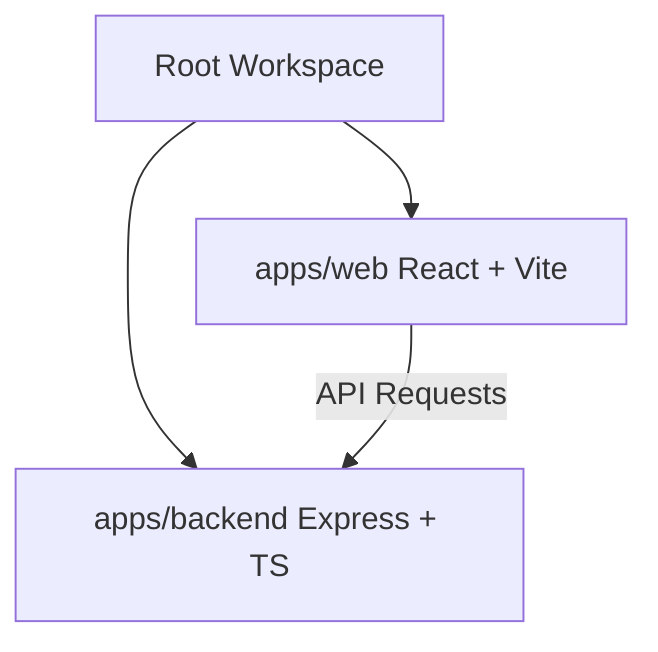

# Smart Monorepo

NPM Workspaces monorepo contianing a React frontend and Express TypeScript backend.

## 📁 Structure

```text
smart/
├── apps/
│   ├── web/         # React + Vite (Port 5173)
│   └── backend/     # Express + TypeScript (Port 5000)
├── package.json     # Monorepo Workspace Configuration
└── README.md
```

## 🛠️ Monorepo Architecture



## 🚀 Available Scripts

Semua perintah di bawah ini dapat dijalankan dari direktori root:

* **`npm run dev`**: Menjalankan frontend dan backend secara bersamaan menggunakan `concurrently`.
* **`npm run dev:web`**: Hanya menjalankan development server untuk frontend (`apps/web`).
* **`npm run dev:backend`**: Hanya menjalankan development server untuk backend (`apps/backend`).
* **`npm run build`**: Mengompilasi frontend dan backend untuk production.
* **`npm run build:web`**: Mengompilasi frontend (`apps/web`).
* **`npm run build:backend`**: Mengompilasi backend (`apps/backend`).
* **`npm run start:backend`**: Menjalankan backend production build (`dist/index.js`).

## 🔗 Port Mappings

* **Frontend Dashboard**: [http://localhost:5173](http://localhost:5173)
* **Backend API**: [http://localhost:5000/api/info](http://localhost:5000/api/info)
